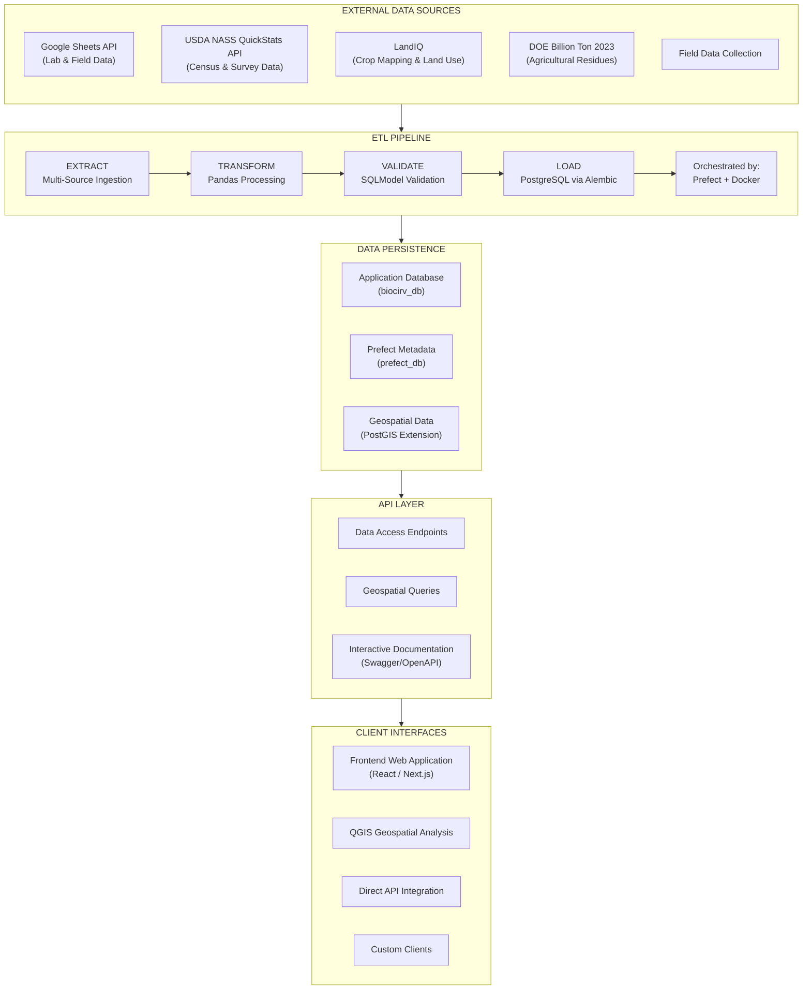

# CA-Biositing Architecture Documentation

## Overview

CA-Biositing is a comprehensive geospatial bioeconomy platform for biodiversity
data management and analysis, specifically focused on California biositing
activities. The project combines ETL data pipelines, REST APIs, geospatial
analysis tools, and web interfaces to support biodiversity research and
conservation efforts. It processes data from Google Sheets into PostgreSQL
databases and provides both programmatic and visual access to the data.

## System Architecture Diagram



## Core Technology Stack

### Backend Infrastructure

- **Programming Language**: Python 3.12+
- **Database**: PostgreSQL 13+ with PostGIS extension
- **Database Migrations**: Alembic for schema versioning
- **Data Models**: SQLModel (combining SQLAlchemy + Pydantic)
- **API Framework**: FastAPI with automatic OpenAPI documentation
- **Data Processing**: pandas for transformation and analysis

### ETL Pipeline & Orchestration

- **Workflow Orchestration**: Prefect for pipeline management
- **Containerization**: Docker & Docker Compose for service orchestration
- **Data Sources**: Google Sheets API (lab & field data), USDA NASS QuickStats
  API (census & survey), LandIQ (crop mapping), DOE Billion Ton 2023
  (agricultural residues)
- **Data Validation**: Pydantic models for type safety and validation

### Frontend & Visualization

- **Frontend Framework**: React/Next.js (separate repository:
  `cal-bioscape-frontend`)
- **Geospatial Analysis**: QGIS integration for advanced spatial analysis
- **Package Management**: Node.js/npm for frontend dependencies

### Development & Deployment

- **Package Management**: Pixi for Python dependency management and task
  automation
- **Development Environment**: VS Code with dev containers
- **Code Quality**: Pre-commit hooks, pytest for testing
- **Version Control**: Git with submodules for frontend integration

### Cloud Infrastructure & Services

- **Google Cloud Platform**:
  - Google Sheets API for data ingestion
  - Google Cloud credentials management
  - Potential cloud deployment target
- **Database Hosting**: Containerized PostgreSQL (development), cloud SQL
  (production)
- **Container Registry**: For Docker image distribution

## Detailed Project Structure

### Namespace Package Architecture (PEP 420)

```
ca-biositing/
├── src/ca_biositing/                    # PEP 420 namespace package root for all submodules
│   ├── datamodels/                      # Database models, schema definitions, and ORM setup
│   │   ├── ca_biositing/datamodels/     # SQLModel-based data models
│   │   │   ├── models/                  # Hand-written SQLModel classes (91 models, 15 subdirs)
│   │   │   │   ├── __init__.py          # Central re-export of all models
│   │   │   │   ├── base.py              # Base classes (BaseEntity, LookupBase, etc.)
│   │   │   │   ├── aim1_records/        # Aim 1 analytical records
│   │   │   │   ├── aim2_records/        # Aim 2 processing records
│   │   │   │   ├── core/                # ETL lineage and run tracking
│   │   │   │   ├── external_data/       # LandIQ, USDA, Billion Ton records
│   │   │   │   ├── field_sampling/      # Field samples and collection methods
│   │   │   │   ├── general_analysis/    # Observations and analysis types
│   │   │   │   ├── places/              # Location and address models
│   │   │   │   └── ...                  # (+ 6 more domain subdirectories)
│   │   │   ├── views.py                 # 7 materialized view definitions
│   │   │   ├── config.py                # SQLModel and database configuration
│   │   │   └── database.py              # Database engine setup and connection logic
│   │   ├── tests/                       # Unit tests for datamodels package
│   │   └── pyproject.toml               # Independent packaging and dependencies for datamodels
│   │
│   ├── pipeline/                        # ETL and workflow orchestration components
│   │   ├── ca_biositing/pipeline/       # Main ETL logic for data ingestion and transformation
│   │   │   ├── etl/                     # Extract, Transform, Load core logic
│   │   │   ├── load/                    # Data loading processes into PostgreSQL
│   │   │   ├── transform/               # Data transformation utilities using pandas
│   │   │   ├── flows/                   # Prefect flow definitions for orchestrating pipelines
│   │   │   └── utils/                   # Helper scripts and utility functions for ETL tasks
│   │   ├── tests/                       # Pipeline-specific tests
│   │   └── pyproject.toml               # Pipeline-specific dependencies and build info
│   │
│   └── webservice/                      # FastAPI backend service for REST API access
│       ├── ca_biositing/webservice/     # Web service source files
│       │   ├── main.py                  # FastAPI entry point (app startup)
│       │   └── __init__.py              # Package initialization
│       ├── tests/                       # Tests for webservice routes and API endpoints
│       └── pyproject.toml               # Dependencies for webservice package
│
├── resources/                           # Infrastructure, Docker, and Prefect configuration
│   ├── docker/                          # Docker setup for local and production environments
│   │   ├── docker-compose.yml           # Multi-container setup for development
│   │   ├── pipeline.dockerfile          # Dockerfile for ETL pipeline container
│   │   ├── .env.example                 # Environment variable template for local setup
│   │   └── create_prefect_db.sql        # SQL script for Prefect metadata DB initialization
│   └── prefect/                         # Prefect deployment and orchestration setup
│       ├── prefect.yaml                 # Prefect deployment configuration
│       ├── deploy.py                    # Script to automate Prefect flow deployment
│       └── run_prefect_flow.py          # Script to run master ETL Prefect flow
│
├── docs/                                # MkDocs documentation folder
│   ├── architecture.md                  # Main architecture document (this file)
│   ├── api/                             # REST API documentation
│   ├── pipeline/                        # Pipeline workflow documentation (ETL, Docker, Prefect, GCP)
│   ├── datamodels/                      # Datamodel documentation overview
│   ├── webservice/                      # FastAPI and API overview documentation
│   └── resources/                       # Deployment and infra docs (Docker/Prefect)
│
├── alembic/                             # Database migration management (Alembic)
│   ├── env.py                           # Alembic environment configuration
│   └── versions/                        # Versioned migration scripts
│
├── tests/                               # Integration and namespace import tests
├── frontend/ (submodule: cal-bioscape-frontend)  # React/Next.js frontend repo as Git submodule
├── .devcontainer/                       # VS Code dev container configuration for reproducible dev env
├── .github/                             # CI/CD workflows, issue templates, PR templates
├── .vscode/                             # Editor settings and recommended extensions
├── pixi.toml                            # Pixi project config for dependency & task management
├── pixi.lock                            # Dependency lock file for reproducibility
├── readthedocs.yaml                     # ReadTheDocs build configuration
├── .pre-commit-config.yaml              # Code linting and formatting pre-commit hooks
├── config.py                            # Global configuration and environment variables
└── README.md                            # Root project overview and instructions
```

## Data Flow Architecture

### 1. Data Ingestion (Extract)

```
Data Sources ──APIs──▶ Python ETL Pipeline (Prefect-orchestrated)
     │                        │
     ├── Google Sheets        ├── Google Sheets API Client (credentials.json)
     │   ├── Lab Data         │
     │   ├── Field Samples    │
     │   └── Resource Info    │
     │                        │
     ├── USDA NASS API        ├── QuickStats REST Client (API key auth)
     │   ├── Census Data      │   └── 16+ commodity mappings
     │   └── Survey Data      │
     │                        │
     ├── LandIQ               ├── Crop mapping & land use data
     │                        │
     └── DOE Billion Ton      └── Agricultural residue estimates
```

### 2. Data Processing (Transform)

```
Raw Data ──pandas──▶ Cleaned Data ──SQLModel──▶ Validated Data
    │                     │                         │
    ├── Data Cleaning     ├── Normalization         ├── Type Validation
    ├── Format Conversion ├── Standardization       ├── Business Rules
    └── Quality Checks    └── Enrichment           └── Constraint Checking
```

### 3. Data Persistence (Load)

```
Validated Data ──Alembic──▶ PostgreSQL Database
       │                         │
       ├── Schema Validation     ├── ACID Transactions
       ├── Batch Processing      ├── Geospatial Extensions
       └── Conflict Resolution   └── Performance Optimization
```

### 4. Data Access & Consumption

```
PostgreSQL ──SQLModel──▶ FastAPI ──HTTP/JSON──▶ Client Applications
     │                     │                        │
     ├── Query Optimization├── REST Endpoints       ├── Web Frontend
     ├── Geospatial Queries├── OpenAPI Documentation├── QGIS Integration
     └── Aggregations      └── Type-safe Responses └── Direct API Access
```

## Service Architecture (Docker Compose)

### Development Environment Services

1. **PostgreSQL Database** (`db`)
   - **Image**: PostgreSQL 13+
   - **Purpose**: Primary data storage for application and Prefect metadata
   - **Databases**:
     - `biocirv_db` - Application data
     - `prefect_db` - Prefect workflow metadata
   - **Extensions**: PostGIS for geospatial data support
   - **Port**: 5432 (configurable)
   - **Persistence**: Docker volumes for data durability

2. **Database Migration** (`setup-db`)
   - **Purpose**: One-time schema initialization and upgrades
   - **Tool**: Alembic for version-controlled migrations
   - **Dependency**: Waits for database health check
   - **Execution**: Runs on service startup

3. **Prefect Server** (`prefect-server`)
   - **Purpose**: Workflow orchestration and monitoring
   - **Port**: 4200 (Web UI and API)
   - **Features**:
     - Flow scheduling and execution
     - Real-time monitoring dashboard
     - Workflow history and logging
     - Work pool management

4. **Prefect Worker** (`prefect-worker`)
   - **Purpose**: Execute flow runs from work pools
   - **Features**:
     - Process-based task execution
     - Access to Google Cloud credentials
     - Connection to application database
     - Automatic retry and error handling

### Network Architecture

- **Internal Network**: `prefect-network` bridge network
- **Service Discovery**: Container names as hostnames
- **External Access**: Mapped ports for UI and database access

## Data Models & Entities

All models are hand-written SQLModel classes in
`src/ca_biositing/datamodels/ca_biositing/datamodels/models/`, organized into 15
subdirectories (91 models total). Four base mixins (`BaseEntity`, `LookupBase`,
`Aim1RecordBase`, `Aim2RecordBase`) in `models/base.py` provide shared columns.

### Core Domain Models

#### Resource & Biomass Models (`resource_information/`)

- **Resource**: Core biomass resource definitions
- **ResourceClass**, **ResourceSubclass**: Hierarchical resource classification
- **ResourceAvailability**: Seasonal and quantitative availability data
- **ResourceMorphology**, **ResourceCounterfactual**: Physical characteristics
- **PrimaryAgProduct**: Agricultural product classifications

#### Geographic Models (`places/`)

- **Place**: Primary geographic entity (county-level, with FIPS geoid)
- **LocationAddress**: Address information linked to places

#### Field Sampling (`field_sampling/`)

- **FieldSample**: Field collection metadata and measurements
- **HarvestMethod**, **CollectionMethod**, **AgTreatment**: Methodology lookups
- **SoilType**, **LocationSoilType**: Soil classification

#### Aim 1 Analytical Records (`aim1_records/`)

- **ProximateRecord**, **UltimateRecord**, **CompositionalRecord**: Core
  analyses
- **IcpRecord**, **XrfRecord**, **XrdRecord**: Elemental/structural analyses
- **CalorimetryRecord**, **FtnirRecord**, **RgbRecord**: Thermal/spectral
  analyses

#### Aim 2 Processing Records (`aim2_records/`)

- **AutoclaveRecord**, **FermentationRecord**, **GasificationRecord**,
  **PretreatmentRecord**: Conversion process data

#### External Data (`external_data/`)

- **UsdaCensusRecord**, **UsdaSurveyRecord**, **UsdaCommodity**: USDA NASS data
- **LandiqRecord**, **LandiqResourceMapping**: Land IQ crop mapping data
- **BillionTon2023Record**: DOE Billion Ton agricultural residue data
- **Polygon**: Geospatial polygon data (PostGIS geometry)

#### People & Organizations (`people/`)

- **Contact**: Researchers and contact information
- **Provider**: Research institutions and organizations

#### Experiment & Equipment (`experiment_equipment/`)

- **Experiment**, **ExperimentAnalysis**: Experimental design and linkage
- **Equipment**, **ExperimentEquipment**: Lab equipment tracking

#### Methods, Parameters & Units (`methods_parameters_units/`)

- **Method**, **MethodCategory**, **MethodStandard**: Methodology definitions
- **Parameter**, **Unit**, **ParameterUnit**: Measurement framework

#### Core Metadata (`core/`)

- **EtlRun**, **LineageGroup**, **EntityLineage**: ETL tracking and data lineage

#### Infrastructure (`infrastructure/`)

- **InfrastructureBiodieselPlants**, **InfrastructureEthanolBiorefineries**,
  **InfrastructureLandfills**, and 10 other facility types

## Google Cloud Integration

### Google Sheets API Integration

```
Google Cloud Platform
├── Service Account Authentication
│   ├── credentials.json (local development)
│   └── IAM roles for Sheets API access
├── Google Sheets API v4
│   ├── Read access to research data sheets
│   ├── Rate limiting and quota management
│   └── Error handling and retry logic
└── Data Security
    ├── OAuth 2.0 authentication flow
    ├── API key management
    └── Access logging and monitoring
```

### Authentication Flow

1. **Service Account**: Created in Google Cloud Console
2. **Credentials**: Downloaded as `credentials.json`
3. **API Access**: Sheets API enabled for project
4. **Permissions**: Service account granted read access to target sheets
5. **ETL Integration**: Pipeline authenticates and extracts data

### Cloud Deployment Considerations

- **Google Cloud SQL**: PostgreSQL managed database service
- **Google Cloud Run**: Containerized API deployment
- **Google Cloud Build**: CI/CD pipeline for automated deployment
- **Google Cloud Storage**: Backup and archival storage
- **Google Cloud Monitoring**: Application and infrastructure monitoring

## API Architecture (FastAPI)

### REST API Design

The API is organized around feedstock data access, using crop names and
geographic identifiers (FIPS geoid codes) as primary query parameters:

```
/v1/feedstocks/
├── /usda/census/                          # USDA Census agricultural data
│   ├── GET /crops/{crop}/geoid/{geoid}/parameters           # All census parameters
│   ├── GET /crops/{crop}/geoid/{geoid}/parameters/{param}   # Single census parameter
│   ├── GET /resources/{resource}/geoid/{geoid}/parameters   # By resource name
│   └── GET /resources/{resource}/geoid/{geoid}/parameters/{param}
├── /usda/survey/                          # USDA Survey agricultural data
│   ├── GET /crops/{crop}/geoid/{geoid}/parameters           # All survey parameters
│   ├── GET /crops/{crop}/geoid/{geoid}/parameters/{param}   # Single survey parameter
│   ├── GET /resources/{resource}/geoid/{geoid}/parameters   # By resource name
│   └── GET /resources/{resource}/geoid/{geoid}/parameters/{param}
├── /analysis/                             # Laboratory analysis data
│   ├── GET /resources/{resource}/geoid/{geoid}/parameters   # All analysis parameters
│   └── GET /resources/{resource}/geoid/{geoid}/parameters/{param}
└── /availability/                         # Seasonal availability
    └── GET /resources/{resource}/geoid/{geoid}              # Availability window
```

### API Features

- **Auto-generated Documentation**: Swagger UI at `/docs`
- **Type Safety**: Pydantic models for request/response validation
- **Geospatial Queries**: PostGIS integration for spatial operations
- **Pagination**: Efficient handling of large datasets
- **Filtering & Search**: Query parameters for data filtering
- **CORS Support**: Cross-origin resource sharing for web frontend

## Frontend Architecture

### Frontend Repository Integration

- **Repository**: `sustainability-software-lab/cal-bioscape-frontend`
- **Integration**: Git submodule in `frontend/` directory
- **Technology**: React/Next.js with TypeScript
- **Package Management**: npm for Node.js dependencies
- **Development**: Hot reloading and development server

### Frontend-Backend Communication

```
Frontend (React) ──HTTP/REST──▶ Backend API (FastAPI)
     │                               │
     ├── Data Visualization          ├── JSON Responses
     ├── Interactive Maps            ├── Geospatial Data
     ├── Search & Filtering          ├── Query Processing
     └── User Interface              └── Authentication
```

## Development Workflow & Environment Management

### Pixi Environment Configuration

```
Environments:
├── default: General development, testing, pre-commit
├── gis: QGIS and geospatial analysis tools
├── etl: ETL pipeline (used in Docker containers)
├── webservice: FastAPI web service
├── frontend: Node.js/npm for frontend development
├── py312/py313: Python version-specific environments
├── docs: To generate docs using MKdocs
```

### Key Development Tasks

- **Service Management**: Start/stop/monitor Docker services
- **Schema Changes**: Edit SQLModel classes, then `migrate-autogenerate` +
  `migrate`
- **Materialized Views**: Refresh after data loads with `refresh-views`
- **ETL Operations**: Deploy and run data pipelines
- **Testing**: Comprehensive test suites with coverage
- **Code Quality**: Pre-commit hooks, linting, formatting

## Deployment & Operations

### Container Orchestration

- **Development**: Docker Compose for local services
- **Production**: Kubernetes or cloud container services
- **Image Building**: Multi-stage Dockerfiles for optimization
- **Environment Configuration**: Environment variables and secrets

### Database Management

- **Schema Versioning**: Alembic migrations for schema changes
- **Backup Strategy**: Automated database backups
- **Performance Monitoring**: Query optimization and indexing
- **Geospatial Optimization**: PostGIS spatial indexes

### Monitoring & Observability

- **Application Monitoring**: Health checks and metrics
- **Pipeline Monitoring**: Prefect UI for workflow visibility
- **Database Monitoring**: PostgreSQL performance metrics
- **Log Aggregation**: Centralized logging for troubleshooting

## Security Considerations

### Data Security

- **Authentication**: Google Cloud service account authentication
- **API Security**: CORS configuration and rate limiting
- **Database Security**: Connection encryption and access controls
- **Credential Management**: Secure storage of API keys and passwords

### Privacy & Compliance

- **Data Anonymization**: Geographic location anonymization options
- **Access Controls**: Role-based access to sensitive data
- **Audit Logging**: Tracking of data access and modifications
- **Data Retention**: Policies for data lifecycle management

## Scalability & Performance

### Database Optimization

- **Indexing Strategy**: Optimized indexes for common queries
- **Geospatial Performance**: PostGIS spatial indexes and optimization
- **Query Optimization**: Efficient SQL generation via SQLModel
- **Connection Pooling**: Database connection management

### API Performance

- **Caching Strategy**: Redis for frequently accessed data
- **Pagination**: Efficient handling of large result sets
- **Async Processing**: FastAPI async support for I/O operations
- **Rate Limiting**: API throttling for resource protection

### Pipeline Scalability

- **Parallel Processing**: Prefect concurrent task execution
- **Batch Processing**: Efficient bulk data operations
- **Error Recovery**: Automatic retry and failure handling
- **Resource Management**: Memory and CPU optimization

## Future Architecture Considerations

### Microservices Evolution

- **Service Decomposition**: Breaking monolith into focused services
- **API Gateway**: Centralized API management and routing
- **Event-Driven Architecture**: Asynchronous communication patterns
- **Service Mesh**: Advanced networking and observability

### Cloud-Native Enhancements

- **Serverless Functions**: Google Cloud Functions for specific tasks
- **Managed Services**: Cloud SQL, Cloud Storage, Cloud Monitoring
- **Auto-scaling**: Horizontal scaling based on demand
- **Multi-region Deployment**: Geographic distribution for performance

### Advanced Analytics

- **Data Warehouse**: BigQuery integration for analytics
- **Machine Learning**: ML pipelines for predictive analytics
- **Real-time Processing**: Stream processing for live data
- **Data Lake**: Large-scale data storage and processing

This architecture supports the project's mission of providing a robust, scalable
platform for California biodiversity data management while maintaining
flexibility for future enhancements and cloud deployment.
