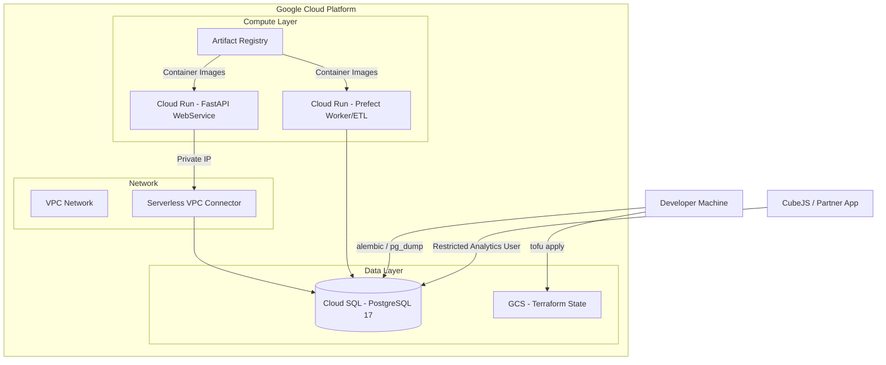

# GCP Deployment Strategy & Developer Collaboration Plan

This document outlines the roadmap for transitioning the `ca-biositing` project
from local development to Google Cloud Platform (GCP) and defines the
collaboration patterns for frontend/analytics developers (CubeJS).

## 1. Current Project State

We are in a **Stabilized Local Development** phase with a **High-Fidelity Cloud
Blueprint** ready for execution.

- **Core Database**: The normalized schema and ETL pipelines are fully
  functional in local Docker containers managed by Pixi.
- **Cloud Infrastructure**: OpenTofu (IaC) is initialized with blueprints for
  Cloud SQL. No live resources have been provisioned yet to minimize costs.
- **Analytics Layer**: The `beam_portal` schema is in the **mapping phase**. We
  have identified the required denormalized views, but the SQL implementation
  and Alembic migrations are pending.

## 2. Collaboration & Access Options

We can support three distinct collaboration patterns for CubeJS development:

| Option              | Approach                                                                              | Effort (Local)    | Framing                                                                |
| :------------------ | :------------------------------------------------------------------------------------ | :---------------- | :--------------------------------------------------------------------- |
| **1. Local-First**  | Developers run the full stack locally via Docker.                                     | **Zero**          | "Ready today for immediate frontend prototyping."                      |
| **2. Hybrid Cloud** | **(Recommended)** Cloud SQL is live; developers connect via **Cloud SQL Auth Proxy**. | **Medium** (~20h) | "Shared source of truth with production-grade security and isolation." |
| **3. Full Cloud**   | Everything (API, DB, CubeJS) runs in Cloud Run.                                       | **High**          | "Final production target for staging and launch."                      |

## 3. Data Migration Logistics (The 3-Stage Path)

To ensure a clean transition to the cloud, we separate Identity, Structure, and
Content:

1.  **Identity (OpenTofu)**: Provisions the database "People" (Users and Roles).
    GCP manages passwords and IAM permissions.
2.  **Structure (Alembic)**: Provisions the database "Folders" (Schemas like
    `beam_portal`) and empty tables/views. This keeps code and database in sync.
3.  **Content (pg_dump)**: Populates the "Folders" with actual data. We use a
    **data-only dump** from our stabilized local environment to fill the cloud
    instance.

## 4. Cloud Architecture Overview

## 5. Division of Labor (The Line)

To ensure focus and security, we propose the following split:

- **Backend/Infra (Your Scope)**:
  - **The Pipe**: Setting up VPC networking, VPC Connectors, and Cloud SQL.
  - **The Core**: Managing normalized tables and the master ETL pipeline.
  - **The Structure**: Implementing the SQL for materialized views in
    `beam_portal`.
- **Frontend/Analytics (Collaborator Scope)**:
  - **The Metrics**: Defining the requirements for denormalized views.
  - **The App**: Deploying and configuring CubeJS instances.
  - **The Presentation**: Translating database views into frontend metrics.

## 6. Implementation Roadmap (Post-Approval)

1.  **Infra Expansion**: Add VPC Connector and Artifact Registry to `main.tf`.
2.  **Identity Setup**: Define `beam_reader` and `biocirv_admin` roles in
    OpenTofu.
3.  **View Engineering**: Write SQL for initial `beam_portal` views and add to
    Alembic.
4.  **Cloud Provisioning**: Run `pixi run cloud-deploy`.
5.  **Secure Migration**: Use Cloud SQL Auth Proxy to run `migrate` and
    `pg_restore`.
