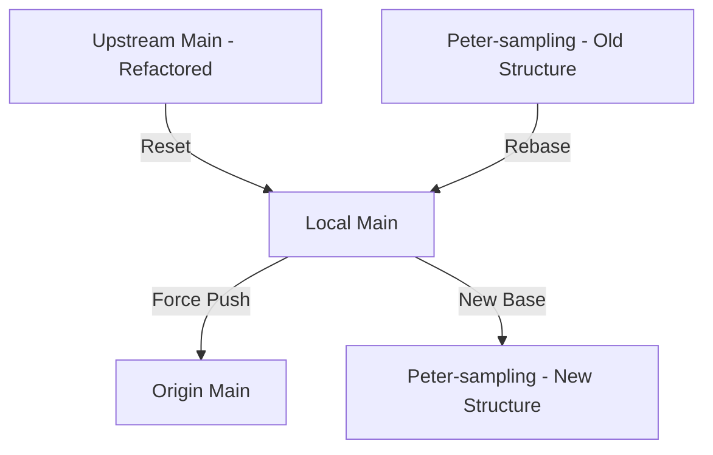

# Git Cleanup and Rebase Plan

This plan outlines the steps to synchronize the local and fork `main` branches with the `upstream` repository and rebase the `Peter-sampling` branch onto the refactored codebase.

## Current State
- **Upstream**: Contains significant refactoring and directory moves.
- **Origin (Fork)**: Out of sync with upstream.
- **Local main**: Out of sync with upstream.
- **Feature Branch**: `Peter-sampling` needs to be moved to the new structure.

## Proposed Workflow

### 1. Synchronize Main Branches
We will first ensure your base is solid by aligning all `main` references to the `upstream` state.

```bash
# Fetch all changes
git fetch --all

# Switch to main and reset to upstream
git checkout main
git reset --hard upstream/main

# Update your fork's main
git push origin main --force
```

### 2. Rebase Feature Branch
Since directories have moved, a standard rebase might trigger many conflicts. We will use `git rebase` and manually resolve the pathing issues.

```bash
git checkout Peter-sampling
git rebase main
```

### 3. Conflict Resolution Strategy
- **Directory Moves**: Git is usually good at detecting renames, but if it fails, you may need to use `git mv` or manually place files in their new locations within the `src/ca_biositing/` sub-packages.
- **Namespace Updates**: Ensure imports reflect the new PEP 420 namespace structure (e.g., `ca_biositing.datamodels`).

### 4. Validation
After rebasing, it is critical to verify the environment.
- Run `pixi install` to ensure dependencies are correct.
- Run `pixi run test` to check for broken imports or logic.

## Mermaid Diagram of State Transition



---
**Note:** Since this involves `--force` operations on `main`, ensure you have no uncommitted work on your local `main` branch before starting.
