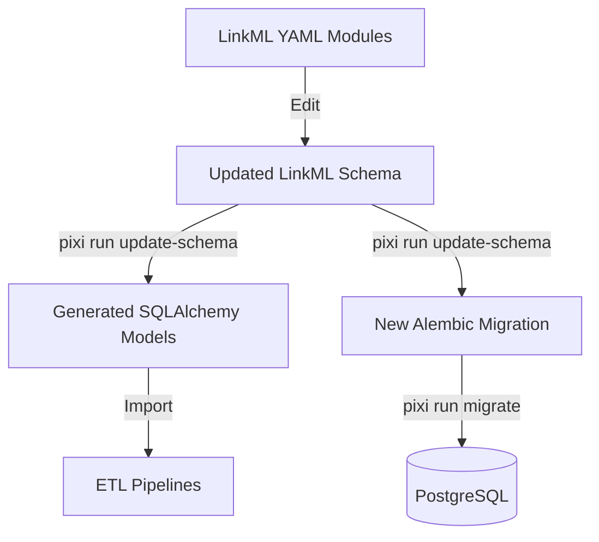

# Git Cleanup and Rebase Plan: Phase 2 (LinkML & Schema)

This plan outlines the steps to align the database schema in the
`Peter-sampling` branch by making LinkML the source of truth, ensuring your ETL
changes are properly integrated into the refactored architecture.

## Current State

- **Rebase Complete**: `Peter-sampling` is now based on the refactored `main`.
- **Source of Truth**: LinkML YAML files in `resources/linkml/modules/`.
- **Goal**: Update LinkML to reflect ETL needs, then use the project's
  orchestration tools to update the DB.

## Proposed Workflow

### 1. LinkML Audit & Update

Instead of manual SQL or Alembic edits, we will update the LinkML schemas.

- **Target Modules**:
  - `resources/linkml/modules/external_data/` (for `LandiqRecord`, `Polygon`)
  - `resources/linkml/modules/field_sampling/` (for `FieldSample`)
  - `resources/linkml/modules/general_analysis/` (for `Observation`)
- **Action**: Add the missing slots (columns) to these YAML files.

### 2. Orchestrated Update

We will use the project's built-in task to synchronize everything.

```bash
# This command generates SQLA models, rebuilds services, and creates a migration
pixi run update-schema -m "integrate_peter_sampling_etl_changes"
```

### 3. Migration Cleanup

Since you have many old local migrations from the rebase:

- We will identify the migration head from `main`.
- We will ensure the new migration generated in Step 2 is the only one adding
  your specific ETL changes.
- We will remove redundant local migrations that are no longer needed because
  LinkML now handles those changes.

### 4. Validation

- Run `pixi run migrate` to apply the changes.
- Run `pixi run test` to verify the end-to-end flow.

## Mermaid Diagram of LinkML Workflow



---

**Next Step**: I will start by reading the LinkML YAML files for the target
tables to see how to best add your missing columns.
