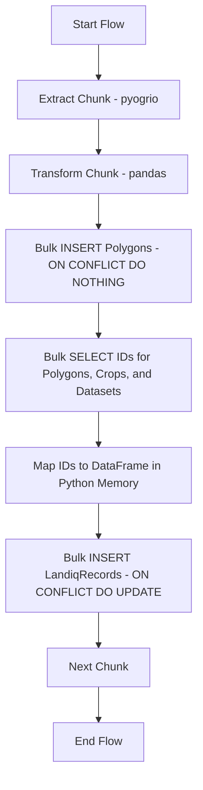

# Plan: LandIQ Loading Performance Optimization (Bulk ID Fetching)

## 1. Current Bottleneck Analysis

The current implementation in
[`landiq.py`](src/ca_biositing/pipeline/ca_biositing/pipeline/etl/load/landiq.py)
uses a row-by-row "check-then-upsert" pattern:

- **N+1 Queries**: For each record, it performs a `SELECT` on `Polygon` and
  another on `LandiqRecord`.
- **Latency**: ~20,000 database round-trips per 10,000-record chunk.
- **Overhead**: High Python/ORM overhead for managing thousands of individual
  objects.

## 2. Proposed Optimization Strategy: Multi-Table Bulk ID Fetching

This strategy reduces the number of database round-trips from thousands to a
fixed set of bulk operations per chunk. It addresses the requirement to resolve
IDs for all normalized columns (Polygons, Crops, Datasets) efficiently.

### Step 1: Bulk Polygon "Insert-Ignore"

- **Action**: Send all geometries in the chunk to the database in one `INSERT`
  statement.
- **Logic**: Use `ON CONFLICT (geom) DO NOTHING`.
- **Requirement**: A unique index on `Polygon.geom`.

### Step 2: Multi-Table Bulk ID Retrieval

Instead of row-by-row lookups, we perform one bulk `SELECT` per related table to
build in-memory mapping dictionaries for the current chunk:

- **Polygons**: `SELECT id, geom FROM polygon WHERE geom IN (...)`
- **Crops**: `SELECT id, name FROM primary_ag_product WHERE name IN (...)`
- **Datasets**: `SELECT id, name FROM data_source WHERE name IN (...)`

### Step 3: In-Memory Normalization (Pandas)

- **Action**: Use the mapping dictionaries to replace name/geometry strings with
  their corresponding integer IDs in the DataFrame.
- **Benefit**: This happens entirely in Python memory, which is extremely fast
  compared to database round-trips.

### Step 4: Bulk LandiqRecord Upsert

- **Action**: Send a single bulk `INSERT` statement for the entire chunk.
- **Logic**: Use `ON CONFLICT (record_id) DO UPDATE SET ...`.
- **Result**: All crop data and metadata are updated or inserted in one
  operation.

## 3. macOS Compatibility & Stability

- **PROJ_LIB**: Explicitly set `PROJ_LIB` in the environment before importing
  `pyproj`/`geopandas` to prevent crashes on Apple Silicon.
- **Memory Management**: Maintain the 10,000-record chunk size to stay within
  Docker memory limits.
- **Lazy Imports**: Keep heavy imports inside the Prefect tasks to avoid
  orchestration deadlocks.

## 4. Implementation Plan

## 5. Todo List for Implementation

1. [ ] Create Alembic migration to add a unique index to `Polygon.geom`.
2. [ ] Implement `bulk_insert_polygons_ignore` using SQLAlchemy's PostgreSQL
       `insert`.
3. [ ] Implement `fetch_lookup_ids` utility to retrieve IDs for Crops and
       Datasets in bulk.
4. [ ] Implement `fetch_polygon_ids_by_geoms` for set-based ID retrieval.
5. [ ] Implement `bulk_upsert_landiq_records` using
       `ON CONFLICT (record_id) DO UPDATE`.
6. [ ] Refactor `load_landiq_record` task to use these bulk steps, replacing the
       current row-by-row loop.
7. [ ] Verify performance improvement and macOS stability with a test run.
